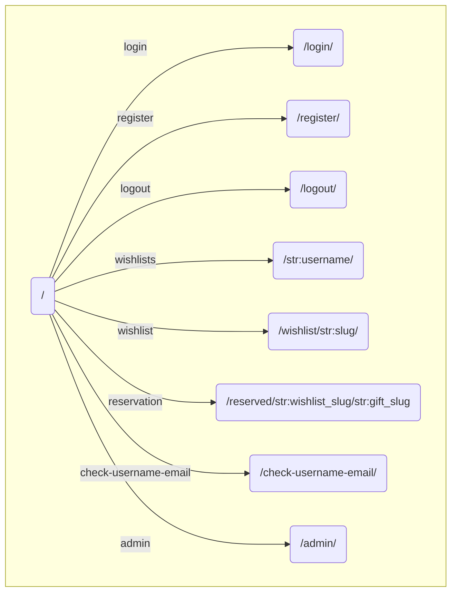

# Небольшой студенческий проект сайта с вишлистами на django

Его основная функция - создание и хранение индивидуальных вишлистов для каждого пользователя, а также отслеживание уже зарезервированных для покупки подарков.

